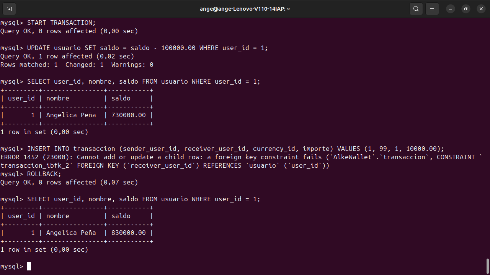
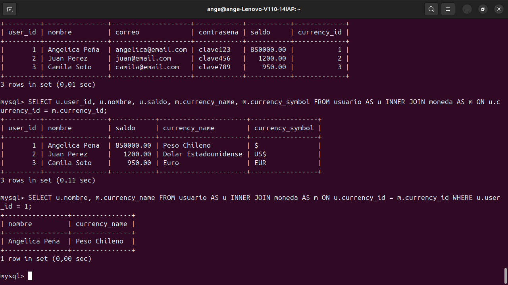
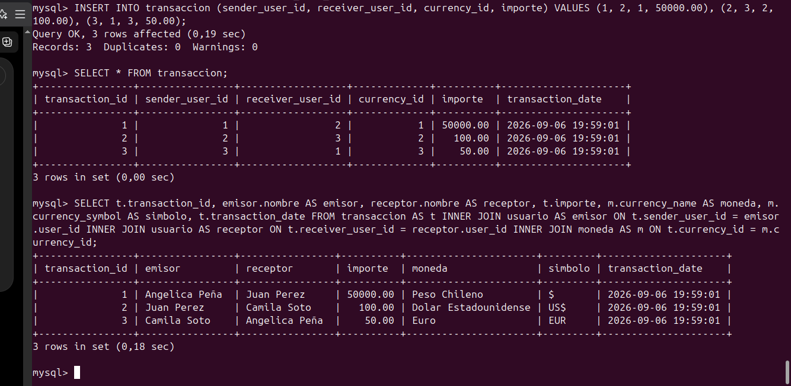
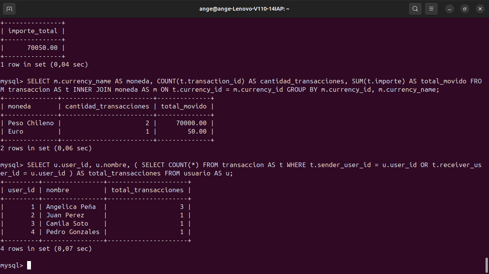
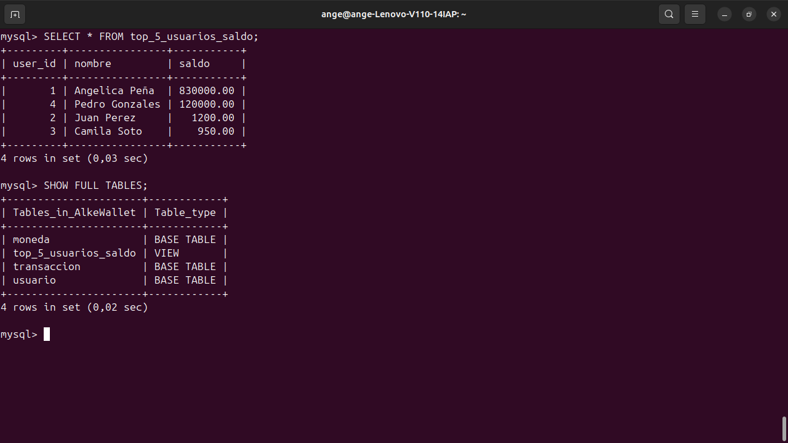
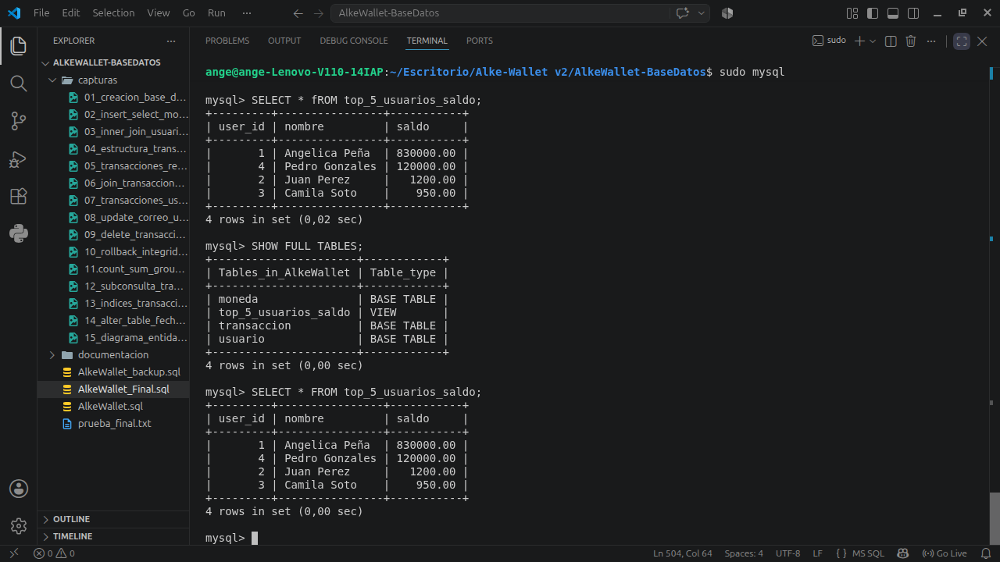

# 💳 Alke Wallet v2 — Base de Datos Relacional


**Alke Wallet v2** es la evolución del proyecto original Alke Wallet hacia una arquitectura basada en **MySQL 8**.  
Esta versión se centra en el diseño e implementación de una base de datos relacional capaz de gestionar usuarios, monedas, saldos y transacciones, aplicando integridad referencial, operaciones SQL y propiedades ACID.

---

## 🚀 Evolución del proyecto

| Versión | Enfoque | Tecnologías |
|---|---|---|
| [Alke Wallet v1](https://github.com/Anzu236/Alke-Wallet) | Aplicación web / Frontend | HTML, CSS, JavaScript, Bootstrap, localStorage |
| **Alke Wallet v2** | Base de datos relacional | MySQL 8, SQL, Ubuntu, dbdiagram.io |
| Alke Wallet v3 *(futuro)* | Aplicación completa | Frontend + Backend + MySQL |

---

## 🎯 Objetivo

Diseñar e implementar una base de datos relacional para administrar:

- 👤 Usuarios
- 💱 Monedas
- 💰 Saldos
- 🔄 Transferencias
- 📋 Historial de transacciones

---

## 🛠️ Tecnologías utilizadas

- **MySQL 8**
- **SQL**
- **Ubuntu**
- **Visual Studio Code**
- **dbdiagram.io**
- **Git**
- **GitHub**

---

## 🗄️ Modelo de datos

La base de datos está compuesta por tres entidades principales.

### `moneda`

| Campo | Descripción |
|---|---|
| `currency_id` | Primary Key |
| `currency_name` | Nombre de la moneda |
| `currency_symbol` | Símbolo de la moneda |

### `usuario`

| Campo | Descripción |
|---|---|
| `user_id` | Primary Key |
| `nombre` | Nombre del usuario |
| `correo` | Correo único |
| `contrasena` | Contraseña de prueba |
| `saldo` | Saldo disponible |
| `currency_id` | Foreign Key hacia `moneda` |
| `fecha_creacion` | Fecha de creación |

### `transaccion`

| Campo | Descripción |
|---|---|
| `transaction_id` | Primary Key |
| `sender_user_id` | Foreign Key del emisor |
| `receiver_user_id` | Foreign Key del receptor |
| `currency_id` | Foreign Key de la moneda |
| `importe` | Monto de la transacción |
| `transaction_date` | Fecha y hora |

---

## 🔗 Diagrama entidad-relación


### Relaciones principales

```text
MONEDA 1 ───────── N USUARIO

USUARIO 1 ──────── N TRANSACCION
          emisor

USUARIO 1 ──────── N TRANSACCION
         receptor

MONEDA 1 ───────── N TRANSACCION
```

El modelo fue normalizado hasta **Tercera Forma Normal (3FN)**.

---

## ✅ Funcionalidades implementadas

- Creación de la base de datos `AlkeWallet`
- Tablas con `PRIMARY KEY` y `FOREIGN KEY`
- Restricciones `NOT NULL` y `UNIQUE`
- Inserción de datos con `INSERT`
- Consultas con `SELECT` y `WHERE`
- Relaciones mediante `INNER JOIN`
- Modificación mediante `UPDATE`
- Eliminación mediante `DELETE`
- Transacciones con `START TRANSACTION`
- Confirmación con `COMMIT`
- Reversión con `ROLLBACK`
- Integridad referencial
- Funciones `COUNT()` y `SUM()`
- Agrupaciones con `GROUP BY`
- Subconsultas
- Índices compuestos
- Modificación de tablas con `ALTER TABLE`
- Vista `top_5_usuarios_saldo`
- Normalización hasta 3FN

---

## 🔎 Ejemplo de JOIN

```sql
SELECT
    t.transaction_id,
    emisor.nombre AS emisor,
    receptor.nombre AS receptor,
    t.importe,
    m.currency_name AS moneda,
    t.transaction_date
FROM transaccion AS t
INNER JOIN usuario AS emisor
    ON t.sender_user_id = emisor.user_id
INNER JOIN usuario AS receptor
    ON t.receiver_user_id = receptor.user_id
INNER JOIN moneda AS m
    ON t.currency_id = m.currency_id;
```

---

## 🔐 Transacciones y propiedades ACID

Ejemplo de una transferencia controlada:

```sql
START TRANSACTION;

UPDATE usuario
SET saldo = saldo - 20000.00
WHERE user_id = 1;

UPDATE usuario
SET saldo = saldo + 20000.00
WHERE user_id = 4;

INSERT INTO transaccion
(sender_user_id, receiver_user_id, currency_id, importe)
VALUES
(1, 4, 1, 20000.00);

COMMIT;
```

| Propiedad | Aplicación en Alke Wallet |
|---|---|
| **Atomicidad** | La transferencia se completa o se revierte |
| **Consistencia** | Las FK mantienen relaciones válidas |
| **Aislamiento** | Los cambios se manejan dentro de una transacción |
| **Durabilidad** | `COMMIT` confirma permanentemente los cambios |

### Prueba de `ROLLBACK`



---

## 📊 Consultas y resultados

### INNER JOIN usuario - moneda



### Transacciones con información completa



### Funciones de agregación


### Subconsulta por usuario



---

## 🏆 Vista Top 5 de usuarios por saldo

```sql
CREATE VIEW top_5_usuarios_saldo AS
SELECT
    user_id,
    nombre,
    saldo
FROM usuario
ORDER BY saldo DESC
LIMIT 5;
```



---

## ▶️ Cómo ejecutar el proyecto

### 1. Clonar el repositorio

```bash
git clone https://github.com/Anzu236/alke-wallet-base-datos.git
```

### 2. Entrar a la carpeta

```bash
cd alke-wallet-base-datos
```

### 3. Ejecutar el script

```bash
sudo mysql < AlkeWallet_Final.sql
```

> ⚠️ **Importante:** `AlkeWallet_Final.sql` contiene `DROP DATABASE IF EXISTS AlkeWallet;`.  
> Si existe una base de datos con ese nombre, será eliminada y reconstruida.

### 4. Verificar la base

```bash
sudo mysql
```

Dentro de MySQL:

```sql
USE AlkeWallet;

SHOW FULL TABLES;

SELECT * FROM usuario;

SELECT * FROM transaccion;
```

---

## 📁 Estructura del repositorio

```text
alke-wallet-base-datos/
├── README.md
├── AlkeWallet.sql
├── AlkeWallet_Final.sql
├── capturas/
│   ├── 01_creacion_base_datos.png
│   ├── ...
│   └── 17_prueba_final_base_datos.png
└── documentacion/
    ├── Informe_AlkeWallet_v2_Angelica_Pena.docx
    └── Informe_AlkeWallet_v2_Angelica_Pena.pdf
```

---

## 📄 Documentación

La carpeta [`documentacion`](documentacion/) contiene el informe completo del proyecto en:

- Word
- PDF

El informe incluye el desarrollo paso a paso, sentencias SQL, modelo entidad-relación, propiedades ACID y evidencias de ejecución.

---

## 🧪 Prueba final

El script final fue probado desde cero en MySQL 8 y permitió reconstruir correctamente la base de datos.



---

## 👩‍💻 Autora

**Angélica Peña**

Ingeniería en Electricidad y Automatización Industrial  
Proyecto académico — 2026

---

### 🔗 Proyecto anterior

➡️ [Alke Wallet v1 — Frontend](https://github.com/Anzu236/Alke-Wallet)
