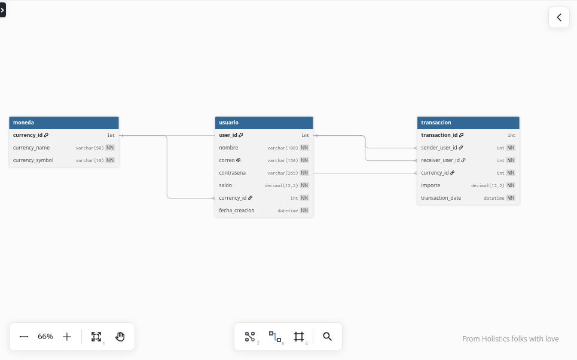

# Alke Wallet v2 - Base de Datos Relacional

Proyecto desarrollado para el módulo **Fundamentos de Bases de Datos Relacionales**.

Esta versión de Alke Wallet corresponde a la evolución del proyecto original hacia una arquitectura basada en **MySQL 8**, incorporando diseño relacional, integridad referencial, consultas SQL y transacciones.

## Objetivo

Diseñar e implementar una base de datos relacional que permita gestionar:

- Usuarios
- Monedas
- Saldos
- Transferencias
- Historial de transacciones

## Tecnologías utilizadas

- MySQL 8
- SQL
- Ubuntu
- Visual Studio Code
- dbdiagram.io
- Git
- GitHub

## Modelo de datos

La base de datos utiliza tres tablas principales:

### moneda

- currency_id - Primary Key
- currency_name
- currency_symbol

### usuario

- user_id - Primary Key
- nombre
- correo - UNIQUE
- contrasena
- saldo
- currency_id - Foreign Key
- fecha_creacion

### transaccion

- transaction_id - Primary Key
- sender_user_id - Foreign Key
- receiver_user_id - Foreign Key
- currency_id - Foreign Key
- importe
- transaction_date

## Diagrama entidad-relación



## Funcionalidades implementadas

- Creación de la base de datos AlkeWallet
- PRIMARY KEY y FOREIGN KEY
- Restricciones NOT NULL y UNIQUE
- INSERT
- SELECT
- WHERE
- INNER JOIN
- UPDATE
- DELETE
- START TRANSACTION
- COMMIT
- ROLLBACK
- Integridad referencial
- COUNT y SUM
- GROUP BY
- Subconsultas
- Índices compuestos
- ALTER TABLE
- Vista Top 5 de usuarios
- Normalización hasta 3FN

## Ejecutar el proyecto

Desde Ubuntu:

```bash
sudo mysql < AlkeWallet_Final.sql


